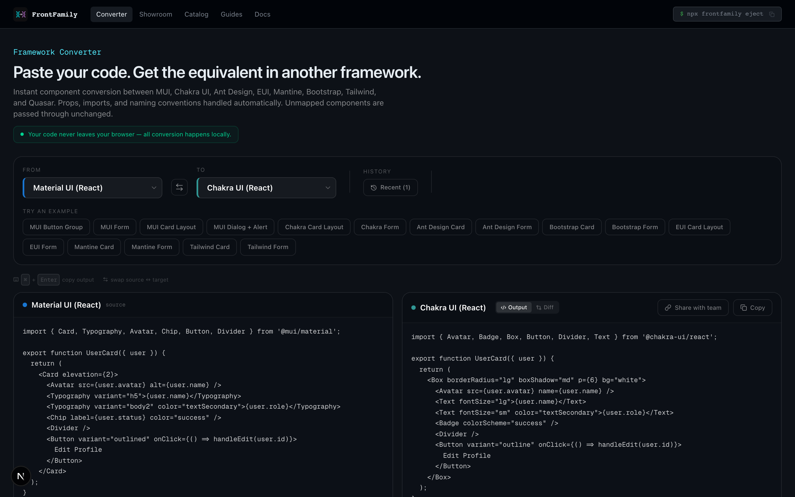
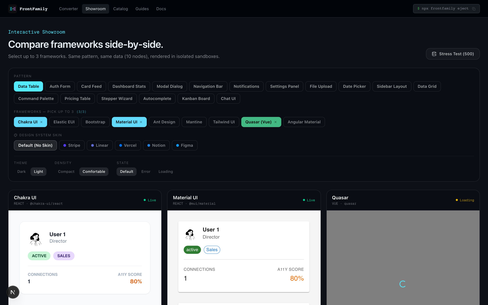
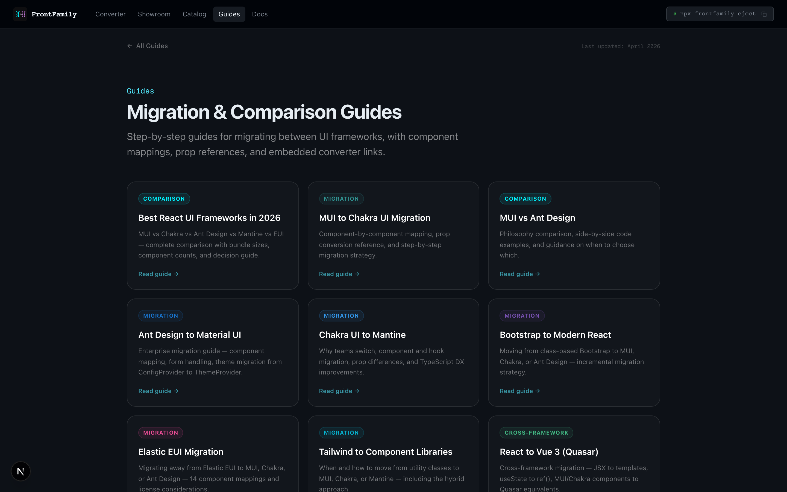

<div align="center">

# FrontFamily

**Convert UI components between frameworks. Compare them side-by-side.**

[Website](https://frontfamily.com) · [Converter](https://frontfamily.com/converter) · [Guides](https://frontfamily.com/guides) · [CLI on npm](https://www.npmjs.com/package/@frontfamily/cli) · [Report Bug](../../issues/new?template=bug_report.md) · [Request Feature](../../issues/new?template=feature_request.md)

[](https://www.npmjs.com/package/@frontfamily/cli)
[](https://www.npmjs.com/package/@frontfamily/cli)
[](LICENSE)

</div>

---

## What is FrontFamily?

FrontFamily is a free developer tool for converting UI component code between frontend frameworks and comparing how they render the same patterns side-by-side.

### Framework Converter

Paste MUI code, get the Chakra UI equivalent — or Ant Design, EUI, Mantine, Bootstrap, Tailwind, Quasar. 42 conversion paths, 219 verified component mappings. Diff view, live preview, shareable URLs.



### Side-by-Side Showroom

Compare up to 3 frameworks rendering the same component simultaneously. Real DOM metrics, render timing, a11y scanning. 5 design system skins (Stripe, Linear, Vercel, Notion, Figma).



### Migration Guides

9 in-depth articles with interactive searchable component reference tables, TypeScript migration patterns, and real-world pitfall warnings.



### CLI

```
$ npx @frontfamily/cli eject auth-form data-table -f react-mui

┌   FrontFamily Eject
│
◆  components/AuthFormPattern.tsx
◆  components/MuiLineage.tsx
│
└  2 ejected
```

162 templates across 9 frameworks. Works offline, no accounts. [Full docs →](https://frontfamily.com/docs)

---

## Coverage

### Converter — 42 conversion paths

| From ↓ / To → | MUI | Chakra | AntD | EUI | Mantine | Tailwind | Quasar |
|---|---|---|---|---|---|---|---|
| **MUI** | — | ✓ | ✓ | ✓ | ✓ | ✓ | ✓ |
| **Chakra UI** | ✓ | — | ✓ | ✓ | ✓ | ✓ | ✓ |
| **Ant Design** | ✓ | ✓ | — | ✓ | ✓ | ✓ | ✓ |
| **Elastic EUI** | ✓ | ✓ | ✓ | — | ✓ | ✓ | ✓ |
| **Mantine** | ✓ | ✓ | ✓ | ✓ | — | ✓ | ✓ |
| **Bootstrap** | ✓ | ✓ | ✓ | ✓ | ✓ | — | ✓ |
| **Tailwind** | ✓ | ✓ | ✓ | ✓ | ✓ | — | ✓ |

### CLI — 162 templates

18 patterns × 9 frameworks. EUI templates use native `@elastic/eui` components.

### Guides — 9 articles, 219 mappings

| Guide | Interactive Search Table |
|---|---|
| [MUI → Chakra UI](https://frontfamily.com/guides/mui-to-chakra) | 28 components |
| [MUI vs Ant Design](https://frontfamily.com/guides/mui-vs-antd) | 26 components |
| [Bootstrap → React](https://frontfamily.com/guides/bootstrap-to-react) | 22 components |
| [Elastic EUI Migration](https://frontfamily.com/guides/eui-migration) | 45 components |
| [Tailwind → Components](https://frontfamily.com/guides/tailwind-to-components) | 21 components |
| [Chakra → Mantine](https://frontfamily.com/guides/chakra-to-mantine) | 27 components |
| [React → Vue (Quasar)](https://frontfamily.com/guides/react-to-vue) | 24 components |
| [Ant Design → MUI](https://frontfamily.com/guides/antd-to-mui) | 26 components |
| [Best React Frameworks 2026](https://frontfamily.com/guides/best-react-ui-frameworks) | Comparison |

---

## Contributing

This is the community hub for FrontFamily. Use it to:

| Action | How |
|---|---|
| **Report a bug** | [Open a bug report](../../issues/new?template=bug_report.md) |
| **Request a feature** | [Open a feature request](../../issues/new?template=feature_request.md) |
| **Fix a component mapping** | [Submit a mapping correction](../../issues/new?template=mapping_correction.md) |
| **Suggest a migration guide** | [Suggest a guide topic](../../issues/new?template=guide_suggestion.md) |

See [CONTRIBUTING.md](CONTRIBUTING.md) for details.

---

## Quick Links

| Resource | Link |
|---|---|
| **Website** | [frontfamily.com](https://frontfamily.com) |
| **Converter** | [frontfamily.com/converter](https://frontfamily.com/converter) |
| **Showroom** | [frontfamily.com/showroom](https://frontfamily.com/showroom) |
| **Catalog** | [frontfamily.com/catalog](https://frontfamily.com/catalog) |
| **Guides** | [frontfamily.com/guides](https://frontfamily.com/guides) |
| **CLI Docs** | [frontfamily.com/docs](https://frontfamily.com/docs) |
| **npm** | [@frontfamily/cli](https://www.npmjs.com/package/@frontfamily/cli) |

---

## License

Apache 2.0 — see [LICENSE](LICENSE) for details.
